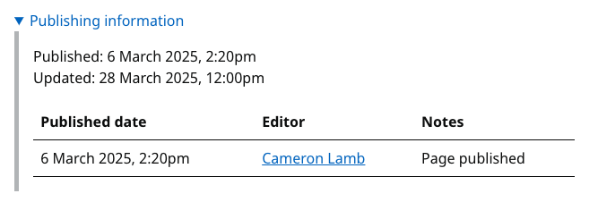
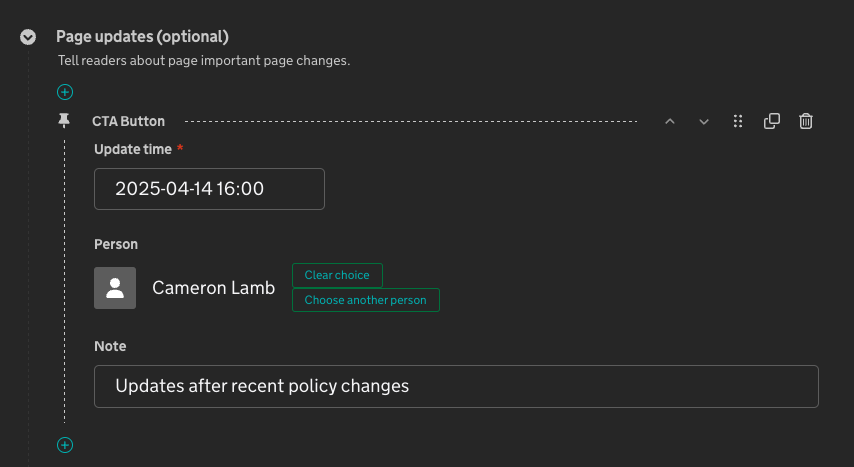

# Publishing information

At the bottom of most pages content pages, there will be the "Publishing information" section.

{ loading=lazy }

By default this section will show the dates that the page was published and when it was last updated. It also holds the first published update note in the updates table.

## How do I add a new row to the update table?

The purpose of this table is to inform readers about important updates to a page.
To add a new row, you can navigate to the edit form and go to the "Publishing" tab. On this tab you will find the "Page updates" field where you can add information about the update you wish to inform the user of.

{ loading=lazy }
