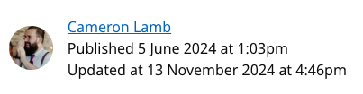

# Editing pages

## Page functionality

### Author

The author is the person that we display to readers of a page at the top with the following look:

{ loading=lazy }

#### How to set/change the author?

The page author looks in the following locations:

* In the edit form for the page, in the "Publishing" tab, the "Page author" field
    * This will let you search and select a person that has a profile on the intranet
* In the edit form for the page, in the "Settings" tab, there is an old field "Perm sec as author" if this is set to True, the value will be the current Perm Sec's name
    * This is an old field, and the new way to set the Perm Sec as the author is to use the "Page author" field in the "Publishing" tab
* The person that first published the page
* The person that first created the page

Based on the above logic, the best way to manage the page author is the "Page author" field in the "Publishing" tab on the edit page.

### Content owner

* What is a content owner?
* How to set the content owner?

### Commenting

* What pages have the commenting functionality?
* Who can comment?
* How do I disable comments for a page?
* Who can delete comments?

### Reactions

* What are reactions?
* What pages have reactions?
* Who can react?
* How do I disable reactions for a page?

### Sidebar - Spotlight

* What is a spotlight?
* What pages can I add a spotlight on?
* What can be "spotlighted"?
* Where do I add a spotlight for a page?

### Sidebar - Useful Links

* What are useful links?
* What pages can have useful links?
* Where do I add a useful links for a page?
* There are extra links showing on my page! Where are they coming from?
